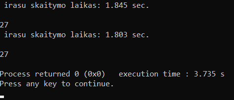
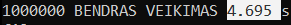
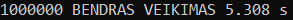

# Vektoriai

## 1 Užduotis
Naudojau operatorių [], kad galėčiau pasirinkti tam tikrą elementą vektoriaus.
Naudojau resize funkcija, kad kada panorėjęs galėčiau pakeisti vektoriaus dydi, kad taip automatiškai pašalinti nereikalingus elementus.
Naudojama buvo ir push_back funkcija, kad įterpti elemntus į vektorių.
Capacity funcija, kad galėčiau sulyginti size ir capacity, kad patikrinčiau atminties persiskirstymus, operatorių =, taip pat buvo naudojami konstruktoriai, destruktoriai
## 2 Užduotis
|   |  Sukurta Vec klase |Esamas Vector   |
|---|---|---|
|10000   | 0.001s. | 0.003s.  |
| 100000  |  0.001s. | 0.002s.  |
|  1000000 |  0.018s. | 0.016s.  |
|10000000|0.206s. |0.18s |
|100000000|1.939s. | 1.705s. |
## 3 Užduotis
Čia skaičuojame kiek kartų įvyksta konteinerių atminties persiskirstymai - 27

## 4 Užduotis 
Čia reikėjo palyginti kiek laiko užtrunka ir ar teisingai veikia mūsų Vector sukurta klasė, su jau esamu vector konteineriu
 
<- Mano sukurta klasė  
  <- Esamas vector  
Galime pastebėti, jog musu kurta klasė veikia greičiau, nei mums jau duotas vector
